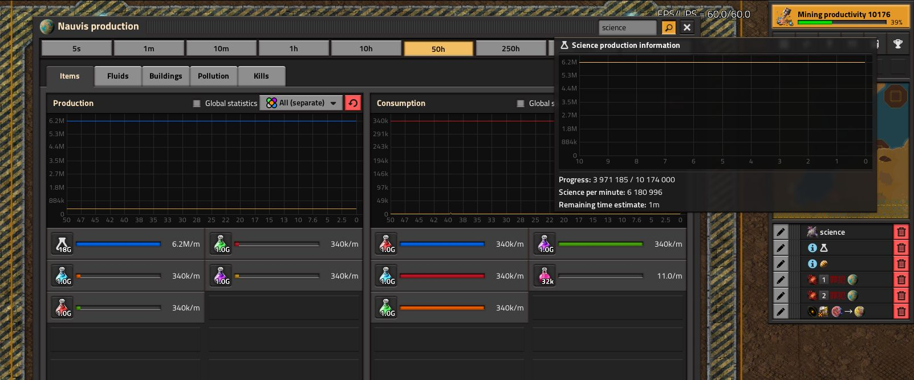
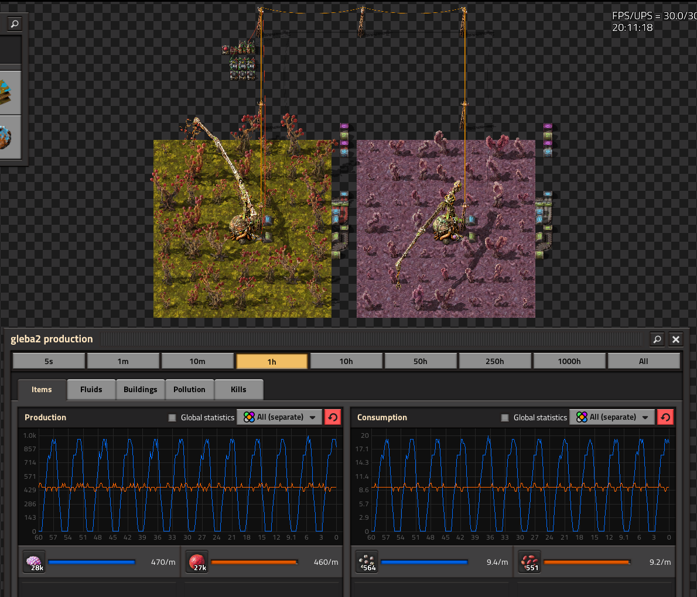
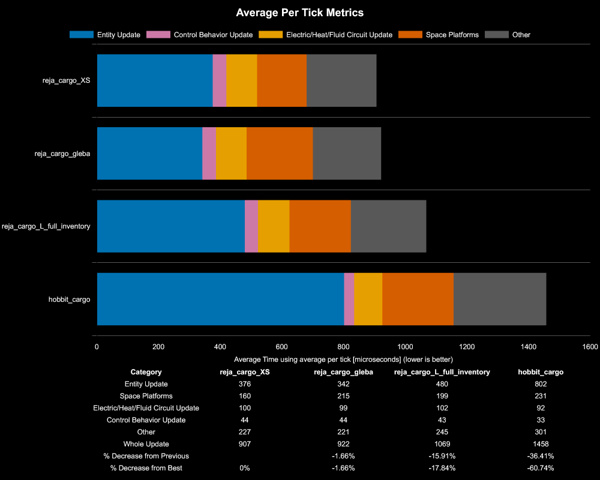
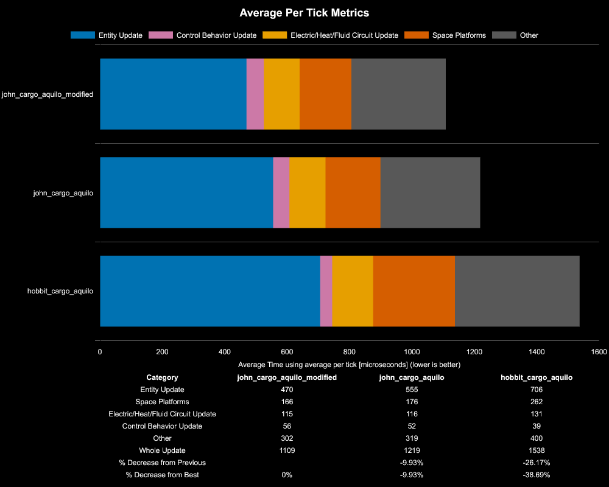

# factorio blueprints

Planos utilizados en mi base de 6 millones eSPM / 340k SPM.

## Contenido
- [Nauvis](#nauvis)
    - [Control de la contaminación](#control-de-la-contaminación)
- [Vulcano](#vulcano)
- [Fulgora](#fulgora)
- [Gleba](#gleba)
    - [Torres agrícolas](#torres-agrícolas)
- [Aquilo](#aquilo)
- [Ciencia espacial](#ciencia-espacial)
- [Ciencia de prometio](#ciencia-de-prometio)
- [Naves de carga](#naves-de-carga)
- [Extras](#extras)

## Nauvis
| Descripción                            | Plano     | Autor      | Video     |
|----------------------------------------|-----------|------------|-----------|
| Ciencia de automatización (480/s)      | [.txt](https://github.com/reja-eng/factorio/tree/main/blueprints/nauvis/automation-science.txt)     | Abucnasty  | [youtube](https://youtu.be/HdMcEn3b55c?si=Vthl258pg4__LinZ)|
| Ciencia logística (480/s)              | [.txt](https://github.com/reja-eng/factorio/tree/main/blueprints/nauvis/logistic-science.txt)       | The end    | [youtube](https://youtu.be/2ENY4AjjdqE?si=DtR070aVo0FO1ebd)|
| Ciencia química (240/s o 1440/s)       | [.txt](https://github.com/reja-eng/factorio/tree/main/blueprints/nauvis/chemical-science.txt)       | Abucnasty  | [youtube](https://youtu.be/ERd_4FzreG4?si=9WkyTKLyXTTaXqdw)|
| Ciencia de producción (240/s o 1440/s) | [.txt](https://github.com/reja-eng/factorio/tree/main/blueprints/nauvis/production-science.txt)     | Akaravortex| [youtube](https://youtu.be/3nzySixYj8g?si=xgrlQZFQD25dhcuW)|
| Ciencia militar (240/s)                | [.txt](https://github.com/reja-eng/factorio/tree/main/blueprints/nauvis/military-science.txt)       | reja       | |
| Ciencia de utilidad (240/s)            | [.txt](https://github.com/reja-eng/factorio/tree/main/blueprints/nauvis/utility-science.txt)        | reja       | |

Diseños viejos, menos eficientes en términos de UPS que los anteriores:
| Descripción                                   | Plano     | Autor      | Video     |
|-----------------------------------------------|-----------|------------|-----------|
| Ciencia de automatización (960/s)             | [.txt](https://github.com/reja-eng/factorio/tree/main/blueprints/nauvis/old/old-automation-science.txt) | reja    | [youtube](https://youtu.be/HdMcEn3b55c?si=Vthl258pg4__LinZ)|
| Ciencia logística (960/s)                     | [.txt](https://github.com/reja-eng/factorio/tree/main/blueprints/nauvis/old/old-logistic-science.txt)   | reja    | [youtube](https://youtu.be/2ENY4AjjdqE?si=DtR070aVo0FO1ebd)|
| Ciencia química (240/s)                       | [.txt](https://github.com/reja-eng/factorio/tree/main/blueprints/nauvis/old/old-chemical-science.txt)   | reja    | [youtube](https://youtu.be/ERd_4FzreG4?si=9WkyTKLyXTTaXqdw)|
| Ciencia de producción (240/s)                 | [.txt](https://github.com/reja-eng/factorio/tree/main/blueprints/nauvis/old/old-production-science.txt) | reja    |

### Control de la contaminación
| Descripción                                   | Plano     | Autor      | Video     |
|-----------------------------------------------|-----------|------------|-----------|
| Árboles + bitter zoos                         | [.txt](https://github.com/reja-eng/factorio/tree/main/blueprints/nauvis/pollution-control.txt)| abucnasty  | [youtube](https://youtu.be/O9Il-vpOXNM?si=FQRj_jgaEYAYT1Dy)|

## Vulcano
| Descripción                                   | Plano     | Autor      |
|-----------------------------------------------|-----------|------------|
| Ciencia metalúrgica                           | [.txt](https://github.com/reja-eng/factorio/tree/main/blueprints/vulcano/metalurgic-science.txt)    | reja       |
| LDS shuffle                                   | [.txt](https://github.com/reja-eng/factorio/tree/main/blueprints/vulcano/lds-shuffle.txt)           |            |

## Fulgora
| Descripción                                           | Plano     | Autor      | Video     |
|-------------------------------------------------------|-----------|------------|-----------|
| Ciencia electromagnética (240/s calidad poco común)   | [.txt](https://github.com/reja-eng/factorio/tree/main/blueprints/fulgora/electromagnetic-science.txt) | clux       | [youtube](https://youtu.be/0-6bzSRd308?si=YAo2J__ef7EphxFM)|

## Gleba
Diseños hechos por mi, inspirados en Konage: [video](https://youtu.be/13ajXHSVdLw?si=d0hnyTJ-lR8fgJIU)
| Descripción                           | Plano     |
|---------------------------------------|-----------|
| Ciencia agrícola (365/s)              | [.txt](https://github.com/reja-eng/factorio/tree/main/blueprints/gleba/agricultural-science.txt)|
| Brazos de apilamiento legendarios     | [.txt](https://github.com/reja-eng/factorio/tree/main/blueprints/gleba/q5-stack-inserters.txt)|
| Fibra de carbono legendaria           | [.txt](https://github.com/reja-eng/factorio/tree/main/blueprints/gleba/q5-carbon-fiber.txt)|
| Biocámaras legendarias                | [.txt](https://github.com/reja-eng/factorio/tree/main/blueprints/gleba/q5-biochambers.txt)|
| Robot capturador legendario           | [.txt](https://github.com/reja-eng/factorio/tree/main/blueprints/gleba/q5-captive-rockets.txt)|  
| Hierro fundido (17760/s)              | [.txt](https://github.com/reja-eng/factorio/tree/main/blueprints/gleba/molten-iron-gleba.txt)|
| Cobre fundido (16230/s)               | [.txt](https://github.com/reja-eng/factorio/tree/main/blueprints/gleba/molten-copper-gleba.txt)|

## Torres agrícolas
[Planos](https://github.com/reja-eng/factorio/tree/main/blueprints/gleba/agricultural-towers.txt)

Forma de controlar las torres agrícolas con circuitos inspirada en Konage. El principal beneficio de este método es la estabilidad a la hora de cosechar las frutas a costa de un 2% menos de producción, fundamental a la hora de usar mi diseño de ciencia agrícola.
En este ejemplo la torre que cosecha yumako esta siendo controlada por este circuito mientras que la de jelly no:

## Aquilo

| Descripción                           | Plano     | Autor       |
|---------------------------------------|-----------|-------------|
| Ciencia criogénica (232,75/s)         | [.txt](https://github.com/reja-eng/factorio/tree/main/blueprints/aquilo/cryogenic-science.txt)    | reja       |
| Combustible de cohete legendario      | [.txt](https://github.com/reja-eng/factorio/tree/main/blueprints/aquilo/q5-rocket-fuel.txt)       | reja       |
| Procesadores cuánticos                | [.txt](https://github.com/reja-eng/factorio/tree/main/blueprints/aquilo/quantum-processor.txt)    | reja       |

## Ciencia espacial

| Descripción                           | Plano     |
|---------------------------------------|-----------|
| Ciencia espacial calidad rara (1280/s equivalente a 3840/s de calidad común)     | [.txt](https://github.com/reja-eng/factorio/tree/main/blueprints/ships/q3-space-science.txt)    | Akaravortex       |

## Ciencia de prometio

| Descripción                           | Plano     | Autor     | Video     |
|---------------------------------------|-----------|-----------|-----------|
| Hiwashi v6.2 216k huevos de bitter    | [.txt](https://github.com/reja-eng/factorio/tree/main/blueprints/ships/hiwashi6-2.txt) | clux | [youtube](https://youtu.be/NU-C7koOvI8?si=GC2I2CZ8kuBXzFi5)

## Naves de carga
[Planos](https://github.com/reja-eng/factorio/tree/main/blueprints/ships/cargo-ships.txt)

Pensadas para megabases, optimizadas al máximo en UPS. Las Didis hechas por mi, Fulma adaptada por JohnFactory:

| Descripción       | Versión   | Almacenamiento   |
|-------------------|-----------|------------------|
| Didi XS           | 2         | 210k~ de ciencia |
| Didi S            | 2         | 275k~ de ciencia |
| Didi M            | 2         | 610k~ de ciencia |
| Didi L            | 2         | 850k~ de ciencia |
| Didi (Gleba)      | 2.1       | 580k~ de ciencia |
| Fulma (Aquilo)    | 1.1       | 750k~ de ciencia |

Comparándolas con naves conocidas como las de stfhobbit ([video](https://youtu.be/c56bakEJ1G8?si=5qAq3UstvHY0HGcD)), mis naves son hasta un 60% más eficientes en términos de UPS:

Los benchmarcks fueron realizados por 21600 ticks por 16 runs para cada diseño

## Extras
| Descripción                                           | Plano     |
|-------------------------------------------------------|-----------|
| Casino espacial                                       | [.txt](https://github.com/reja-eng/factorio/tree/main/blueprints/extras/space-casino.txt)   |
| Spidermall                                            | [.txt](https://github.com/reja-eng/factorio/tree/main/blueprints/extras/spider-mall.txt)    |
| Perforadoras, hierro y cobre fundido para nauvis      | [.txt](https://github.com/reja-eng/factorio/tree/main/blueprints/extras/drills.txt)         |
| Inserter throughput                                   | [.txt](https://github.com/reja-eng/factorio/tree/main/blueprints/extras/inserters.txt)      |
| Fluid flow tester                                     | [.txt](https://github.com/reja-eng/factorio/tree/main/blueprints/extras/fluid-tester.txt)   |
